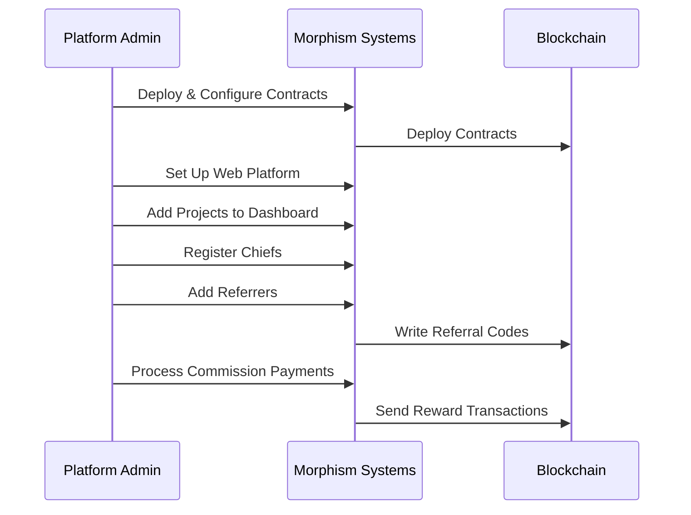
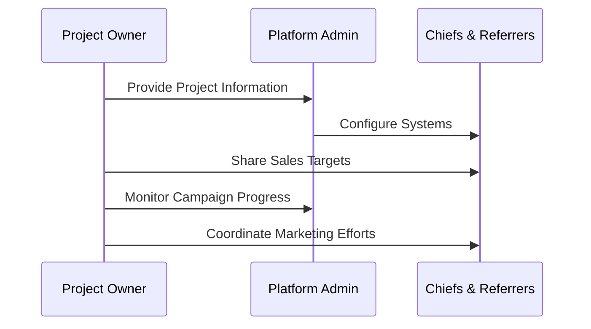
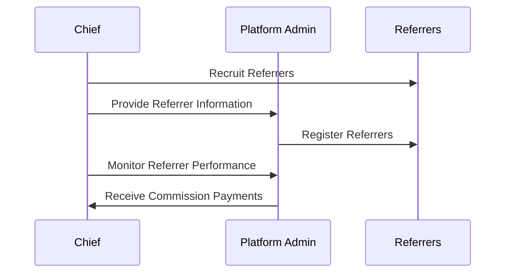
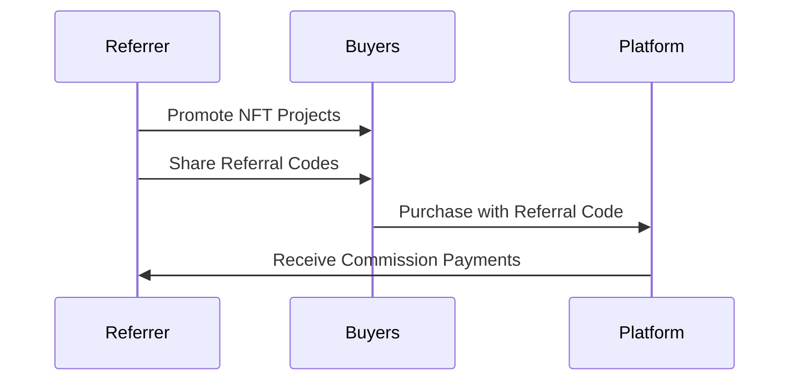
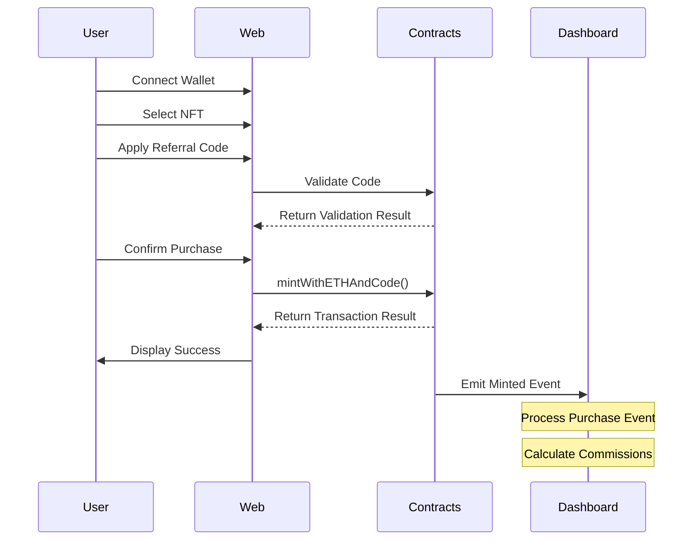
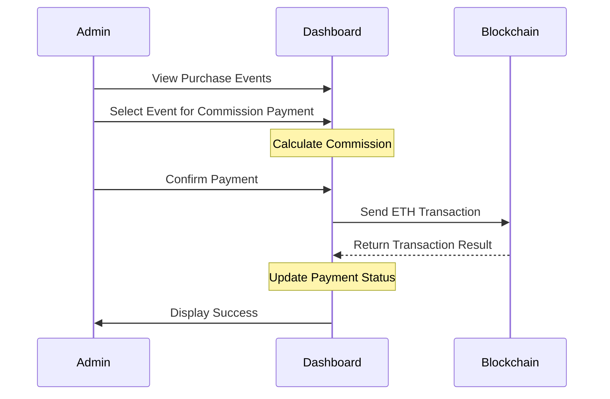
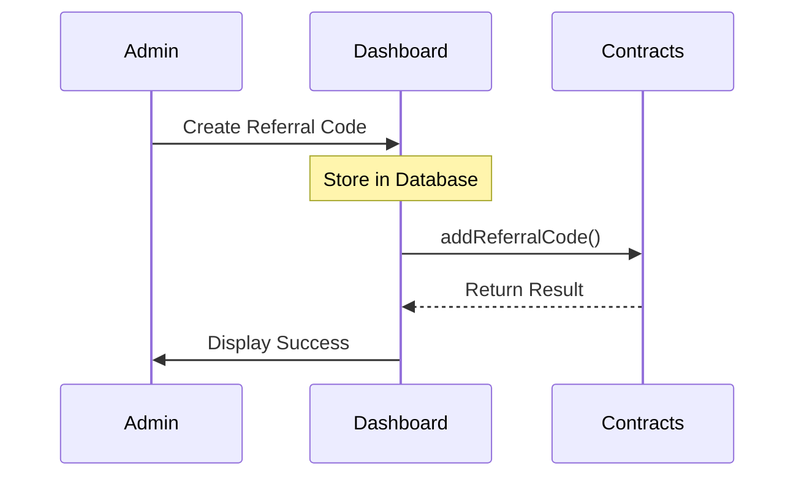

# Morphism Documentation

Welcome to the comprehensive documentation for the Morphism Club ecosystem.

## Components

- [Dashboard](dashboard.html) - Documentation for the administrative dashboard
- [Web](web.html) - Documentation for the web platform
- [Contracts](contracts.html) - Documentation for the smart contracts

## Overview

Morphism Club is a DAO dedicated to scaling personal autonomy through breakthrough technologies. The ecosystem consists of several interconnected components that work together to enable NFT-based fundraising campaigns with referral systems.



## Stakeholder Workflows

The Morphism ecosystem involves four key stakeholders who interact with the system in different ways. Below are the detailed workflows for each stakeholder, showing how they utilize the three main components (Dashboard, Web, and Contracts) of the ecosystem.

### Platform Administrator Workflow

Platform administrators manage the overall ecosystem and ensure its proper functioning:

1. **Contract Deployment and Configuration**
   - Modify parameters in `/contracts` repository
   - Deploy smart contracts to the blockchain
   - Configure contract parameters for NFT sales and referral system

2. **Web Platform Setup**
   - Create and configure project pages in `/web` based on deployed contracts
   - Set up user interfaces for NFT purchases and referral code application
   - Ensure proper integration between web frontend and smart contracts

3. **Dashboard Administration**
   - Add new projects to `/dashboard` with contract addresses and funding targets
   - Register chiefs in the dashboard to manage referrer groups
   - Process pre-registered referrers by:
     - Writing referral codes to the contract via Etherscan's contract interface
     - Adding referrer information to the dashboard
   - Distribute commission payments to referrers and chiefs

### Project Owner Workflow

Project owners are the creators seeking funding through NFT sales:

1. **Project Setup**
   - Provide NFT sale information and funding targets to the Platform
   - Communicate project details to Chiefs and Referrers
   - Set expectations for sales targets and timelines

2. **Campaign Monitoring**
   - Track funding progress through the dashboard
   - Monitor referral performance and sales metrics
   - Coordinate with Chiefs and Referrers to optimize campaign performance

### Chief Workflow

Chiefs manage groups of referrers and earn commissions on their sales:

1. **Referrer Recruitment**
   - Recruit referrers to promote NFT sales
   - Communicate project details and commission structures
   - Provide referrer information to Platform for registration

2. **Commission Management**
   - Monitor referrer performance through the dashboard
   - Receive commission payments for referrer sales
   - Track commission payments and distribution

### Referrer Workflow

Referrers promote NFT sales and earn commissions on purchases made with their referral codes:

1. **Buyer Acquisition**
   - Promote NFT projects to potential buyers
   - Share referral codes for discounted purchases
   - Guide buyers through the purchase process

2. **Commission Collection**
   - Track sales attributed to their referral codes
   - Receive commission payments for successful sales
   - Monitor commission status through the dashboard (if given access)

## System Interaction Flow

The complete system interaction flow shows how all stakeholders and components work together in the Morphism ecosystem:

1. Platform administrators deploy contracts and configure the system
2. Project owners provide project details and funding targets
3. Chiefs recruit referrers and provide their information to the platform
4. Referrers promote projects and share referral codes with potential buyers
5. Buyers purchase NFTs using referral codes through the web platform
6. Smart contracts process purchases and record referral information
7. Dashboard tracks purchase events and calculates commissions
8. Platform administrators process commission payments to referrers and chiefs

This integrated workflow demonstrates how the three main components (Dashboard, Web, and Contracts) work together to create a complete NFT fundraising ecosystem with a two-tier referral system.

## System Overview

### Dashboard System

The Morphism Dashboard is an administrative web application that enables project managers to monitor NFT sales, track fundraising progress, and manage referral relationships. Built with Next.js and TypeScript, it implements a domain-driven design architecture with a PostgreSQL database managed through Prisma ORM.

Key features:
- Project management for NFT fundraising campaigns
- Purchase event tracking from blockchain transactions
- Two-tier referral system management (referrers and chiefs)
- Commission calculation and payment processing
- Funding progress visualization and reporting

The dashboard serves as the administrative backend for the entire Morphism ecosystem, providing tools for monitoring on-chain activities and managing off-chain relationships.

### Web Platform System

The Morphism Web Platform is a Next.js-based frontend application that serves as the user-facing interface for the Morphism Club ecosystem. It provides a responsive and feature-rich experience for users to explore projects, purchase NFTs, and engage with the community.

Key features:
- Project showcase with detailed information
- Wallet connection for blockchain interactions
- NFT purchase flow with multi-currency support
- Referral code application for discounted purchases
- Transaction monitoring and confirmation

The web platform is designed to be user-friendly and accessible, with support for both light and dark modes and responsive design for various devices.

### Smart Contracts System

The Morphism Contracts are Solidity-based smart contracts deployed on the Optimism blockchain, providing the trustless backend for the Morphism ecosystem. At the core is the FundraisingNFT contract, a specialized ERC721 implementation for NFT-based fundraising.

Key features:
- NFT minting with ETH and USDC payment options
- Referral system with discount codes
- Multi-currency support with Chainlink oracle integration
- Batch minting capabilities
- Secure fund management and withdrawal

The contracts ensure transparent and secure execution of business logic on the blockchain, handling financial transactions and NFT ownership records.

## Sequence Diagrams

### NFT Purchase Flow

### Commission Payment Flow

### Referral Code Creation Flow

